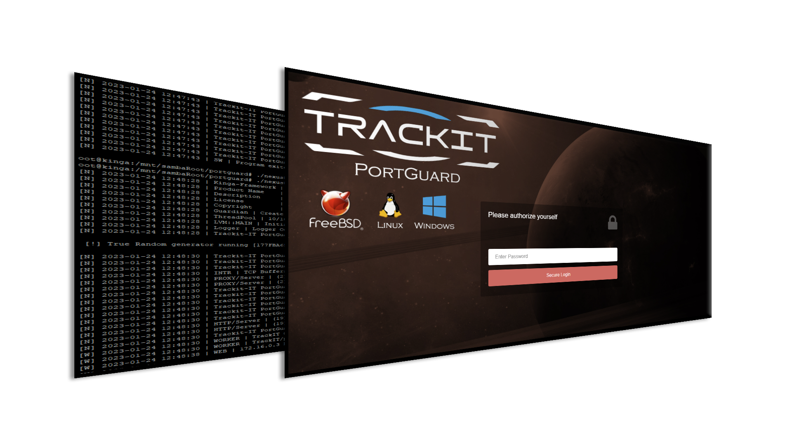

# TrackitIT-PortGuard

**Current Version: 1.0.6**

## In Nutshell
This is a simple TCP Gateway or proxy with advanced security features.
The mechanism similar to port knocking, however much more safe and also very user fiendly. 
This software act as TCP Server Daemon which accepting connections, and when new connection made the software decide to forward or drop regarding the atuhentication.

Connection being tunneled if source IP Address is KNOWN as Trusted. There are a many configurable and various ways to check this: ű
 - DNS Query
 - Flatfile Based 
 - HTTP Query
 - Built-In Webserver 
 - Our eneterprise-class trackit-2019 monitoring instance

The software has built-in Flood, Denial Of Service detection and protection. 
The software hard to be exploited due it is running on Low-Level Virtual Machine like framework with the speed of pure C/C++. 
Also the software does not requires privileges at all. The software works on local machine as well remote machines.

From 1.0.4 version there is an ability to turn unsecured traffic into TLS and an ability to forward unathenticated sources too


## Introduction
This is a personal project from the author of nPulse.net, Viktor Hlavaji (DaVieS).
nPulse.net is always willing to share knowledge and resources with others, and I have 10+ experience of making industry-class / enterprise-class softwares.

A daily attacks / not including mailing / increased by 250% since 2020. Protecting the services like VNC, RDP, SMB, NFS, SSH protocols are recommended however sometimes tricky. 
My goal is to supply quality products that proving no need for over-complicated network to make it safe.


Please refer to the website for more informations: [portguard.npulse.net](https://portguard.npulse.net)

## Screenshot


## License: Community Free-Of-Charge Edition
- You can download, install and use the this Application for without any charges and limitations including commercial.
- You can not modify the binaries, disassemble the binaries, resell the software, redistribute the software, etc..
- You are allowed to upload screenshots and videos from the application itself in purpose of documentation, tutorial, HOWTOs
- Please refer to the LICENSE for more informations.

## Cross Platform Installation
### Minimum Requirements
- At least a `FreeBSD 12+` or `Linux Kernel 3.16, GLIBC 6` or `Windows 7+` required to installed onto your target machine.
- Minimum 64MB of free space on /var/lib or on your drive for the binaries
- Network interface

### On Windows
#### 1) Log in to your Windows Box and download the zip file, enter installers/windows and run setup.exe

### On *Nix
#### 1) Log in to your unix-like Box and bring-up a root shell
    root@vmhost:~ #

#### 2) Download the latest release
    `wget https://portguard.npulse.net/release.zip` or in FreeBSD: `fetch https://portguard.npulse.net/release.zip`

#### 3) Extract the archive you have downloaded
  `unzip release.zip`
````
        Archive:  release.zip
        creating: release/
    extracting: release/CHANGELOG
    extracting: release/LICENSE
        creating: release/samples/
    extracting: release/samples/ip_allow.txt
    extracting: release/samples/index.php
    extracting: release/samples/main.conf
        creating: release/installers/
        creating: release/installers/FreeBSD/
        creating: release/installers/FreeBSD/lib/
    extracting: release/installers/FreeBSD/lib/freebsd.64
    extracting: release/installers/FreeBSD/lib/freebsd.32
    extracting: release/installers/FreeBSD/rc.conf.trackit
    extracting: release/installers/FreeBSD/setup.32
    extracting: release/installers/FreeBSD/setup.64
    extracting: release/installers/FreeBSD/trackit.init
        creating: release/installers/Linux/
        creating: release/installers/Linux/lib/
    extracting: release/installers/Linux/lib/centos.64
    extracting: release/installers/Linux/lib/centos.32
    extracting: release/installers/Linux/setup.64
    extracting: release/installers/Linux/trackit-portguard.service
    extracting: release/installers/Linux/setup.32
        creating: release/installers/Windows/
    extracting: release/installers/Windows/setup.exe
        creating: release/installers/OldLinux/
        creating: release/installers/OldLinux/lib/
    extracting: release/installers/OldLinux/lib/debian.64
    extracting: release/installers/OldLinux/lib/debian.32
    extracting: release/installers/OldLinux/setup.debian.32
    extracting: release/installers/OldLinux/setup.debian.64
    extracting: release/installers/OldLinux/trackit.init.debian
        creating: release/installers/RaspberryPI32/
        creating: release/installers/RaspberryPI32/lib/
    extracting: release/installers/RaspberryPI32/lib/debian.32
    extracting: release/installers/RaspberryPI32/setup.debian.32
    extracting: release/installers/RaspberryPI32/trackit.init.debian     
````

#### 4) Enter `cd release/installers && ls -la` and run the desired install script like `./FreeBSD/setup.64`
  root@vmhost:~# `./FreeBSD/setup.64`

````
    [N] 2023-01-26 12:07:38 | Kinga-Framework | 2023/01-11@build-229/FreeBSD64-L
    [N] 2023-01-26 12:07:38 | Product Name    | Trackit-Client
    [N] 2023-01-26 12:07:38 | Description     | Trackit-2023 PortGuard
    [N] 2023-01-26 12:07:38 | License         | Licensed as Community/Free
    [N] 2023-01-26 12:07:38 | Copyright       | Copyright for nPulse.net
    [N] 2023-01-26 12:07:38 | Guardian | Create Process, PID: 52994
    [N] 2023-01-26 12:07:38 | SW | VFS:BuiltIn Loaded
    [N] 2023-01-26 12:07:38 | ThreadPool | 10/10 Threads initialised
    [N] 2023-01-26 12:07:38 | LVM::MAIN | Initialising ..
    [E] 2023-01-26 12:07:38 | CONF | Unable to load, file is not accessible: main.conf
    [N] 2023-01-26 12:07:38 | CONF | Not Found: security->secret
    [N] 2023-01-26 12:07:38 | CONF | Not Found: security->api_key


    ----->>>    Please configure settings in main.conf file, then re-run this application!


    [N] 2023-01-26 12:07:40 | SW | Program exited gracefully...
````
#### 5) Enter a path (default: /var/lib/nPulse/trackit-portguard) where you can find your configuration file `main.conf`, edit and save
#### 6) Installation is should be done, you can start/stop your service with systemctl or service command `service trackit-portguard restart` or `systemctl restart trackit-portguard`

### Sample Configuration
````
; Configuration File

core
{
        date_format = %Y/%m/%d  ; Date format, using C-API strftime()
        setuid_user = nobody    ; Unprivileged daemon user, should not be `root` but there is no restriction, you are the owner above the system
        time_format = %H:%M:%S  ; Time format, using C-API strftime()
        version = v32           ; Config File Version
}

dns_auth
{
        dns_server_ip = 8.8.8.8       ; DNS Server IP to be use name resolution, discarding the system ones
        enable = no                   ; Enable this Auth Type (yes/no)
        zone_1 = personal.dyndns.tld  ; DNS Zone (A) & (AAAA) to be fetch when connection received, the software determines the right record type
        zone_2 = personal2.dyndns.tld  
        ; you can define maximum 100 zones with prefixing it with (_) underscore.
}

http_auth
{
        enable = no
        url = https://auth.realm.server.tld/?IP=$IP
        verfyTLS = yes
}

proxy_1 ; You can define maximum 100 proxy group with prefixing it with (_) underscore.
{
        auth_target = 127.0.0.1:22  ; Authenticated Target
        unauth_target = disable     ; UnAuthenticated Target disabled, connection will refused

        auto_blacklist_sec = 600    ; Too many connections and or any harmful behavior welcomed on x seconds blacklist
        enable = no                 ; Enable this Auth Type (yes/no)
        idle_timeout_ms = 60000     ; Connection will reset when idling x amount of millisecond (zero packets)
        ipv4_listen = 0.0.0.0       ; IPv4 Listen address, empty to disable
        ipv6_listen = ::            ; IPv4 Listen address, empty to disable
        max_connections_per_ip = 50 ; Max allowed connection from a single IP address
        port = 1234                 ; TCP Port listetning on
}

proxy_2 ; This redirects all HTTP traffic to internal web_auth before authentication, then pass it through the local webserver
{
    auth_target = 127.0.0.1:8080      ; Authenticated Target
    unauth_target = web_auth          ; UnAuthenticated Target, it will redirect to IP:PORT defined in web_auth section

    auto_blacklist_sec = 600    ; Too many connections and or any harmful behavior welcomed on x seconds blacklist
    enable = no                 ; Enable this Auth Type (yes/no)
    idle_timeout_ms = 60000     ; Connection will reset when idling x amount of millisecond (zero packets)
    ipv4_listen = 0.0.0.0       ; IPv4 Listen address, empty to disable
    ipv6_listen = ::            ; IPv4 Listen address, empty to disable
    max_connections_per_ip = 50 ; Max allowed connection from a single IP address
    port = 80                   ; TCP Port listetning on
}

proxy_3 ; This redirects all HTTPS traffic to external server before authentication, then pass it through the authenticated webserver
{
    auth_target = private.webserver.tld:443    ; Authenticated Target
    unauth_target = public.webserver.tld:443   ; UnAuthenticated Target, it will redirect to IP:PORT defined in web_auth section

    auto_blacklist_sec = 600    ; Too many connections and or any harmful behavior welcomed on x seconds blacklist
    enable = no                 ; Enable this Auth Type (yes/no)
    idle_timeout_ms = 60000     ; Connection will reset when idling x amount of millisecond (zero packets)
    ipv4_listen = 0.0.0.0       ; IPv4 Listen address, empty to disable
    ipv6_listen = ::            ; IPv4 Listen address, empty to disable
    max_connections_per_ip = 50 ; Max allowed connection from a single IP address
    port = 443                  ; TCP Port listetning on
}

proxy_4 ; This redirects all HTTPS (TLS) traffic to a single HTTP nonTLS session, so it adds TLS session to an unencrypted channel
{
    auth_target = 172.16.0.2:80 ; nonTLS target
    auto_blacklist_sec = 600
    enable = no
    idle_timeout_ms = 60000
    ipv4_listen = 0.0.0.0
    ipv6_listen = ::
    max_connections_per_ip = 50
    port = 443
    ssl_cert = ssl/cert.pem    ; SSL Certificate (.crt, .pem) realtive or absolute path
    ssl_chain = ssl/chain.pem  ; SSL Full-Chain (.crt, .pem) realtive or absolute path
    ssl_key = ssl/pkey.pem     ; SSL Private-Key password does not supported
    unauth_target = web_auth
    use_ssl = yes ; Froce TLS/SSL
}

security
{
        api_key = DBE4A775C1509CEAA36A8404C8F227108D74EF0722446E184EF43AABB2135AF0  ; Unused, future proof, dont dispose
        secret = E259D52C84A5B619164C5302C3B30BCCDE938A12BC102F3C521040698845FC42   ; Unused, future proof, dont dispose
}

text_auth
{
        enable = no    ; Enable this Auth Type (yes/no)
        file = ips.txt ; Textfile realtive or absolute location that list all valid IP addresses in new line
}

trackit_global_auth ; This is for our enterprise users
{
        enable = no
        trackit_api_url = trackit.api.company.tld:3030/trackit_global_api_key    
}

trackit_prefix_auth ; This is for our enterprise users
{
        enable = no
        trackit_api_url = trackit.api.company.tld:3030/prefix/prefix_api_key     
}

web_auth
{
        auto_blacklist_sec = 600      ; Too many connections and or any harmful behavior welcomed on x seconds blacklist
        enable = no                   ; Enable this Auth Type (yes/no)
        force_ssl = no                ; Force to HTTPS connection
        ipv4_listen = 0.0.0.0         ; IPv4 Address to listen on, empty to disable
        ipv6_listen = ::              ; IPv4 Address to listen on, empty to disable

        ; Language Section Begin
        lang_access_denied = Access is denied                      
        lang_login_success = Login Accepted
        lang_login_text = Secure Login
        lang_login_text_auth = Your token is valid until [EXPDATE]
        lang_login_text_unauth = Please authorize yourself
        lang_password_text = Enter Password
        ; Language Section End

        max_connections_per_ip = 50 ; maximum connection from single IP address
        password = SIcK7zIQ         ; Plaintext Password for access
        port = 8080                 ; Webserver Port number
        session_duration_min = 15   ; After a success login IP address will be valid for x amount of minutes.
        ssl_cert = ssl/cert.pem     ; SSL Certificate (.crt, .pem) realtive or absolute path
        ssl_chain = ssl/chain.pem   ; SSL Full-Chain (.crt, .pem) realtive or absolute path
        ssl_key = ssl/pkey.pem      ; SSL Private-Key password does not supported
        use_ssl = yes               ; Enable TLS/SSL
}
````